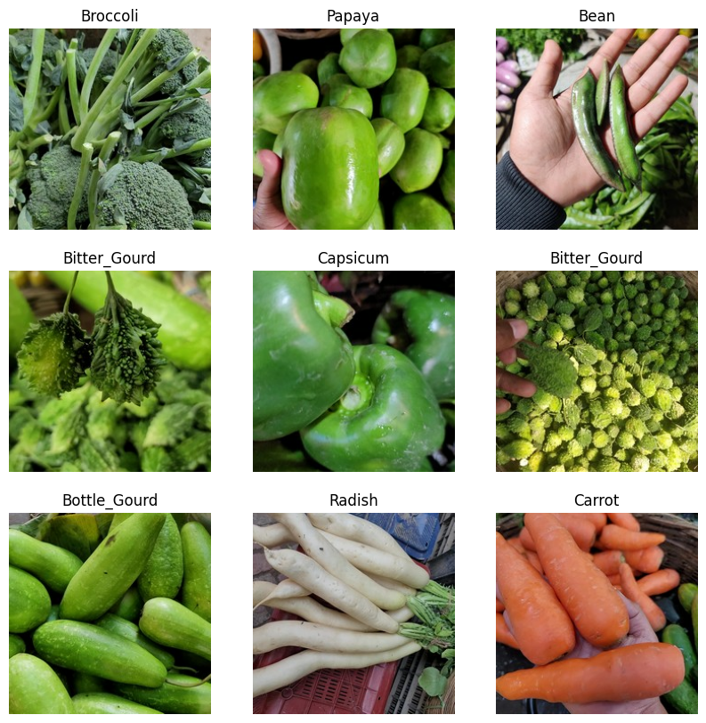
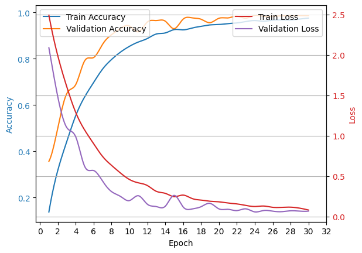
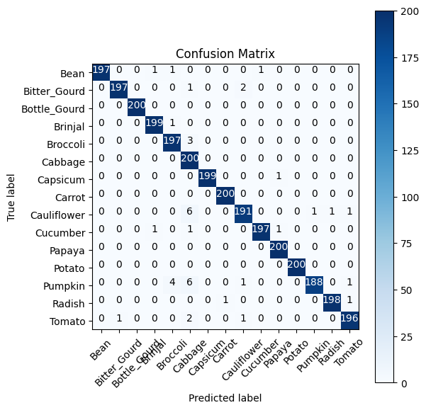
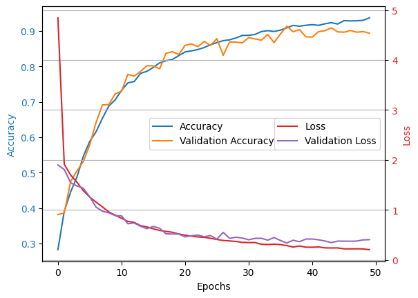
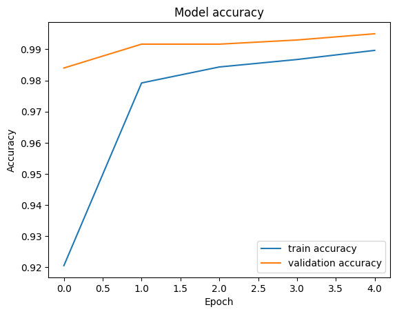
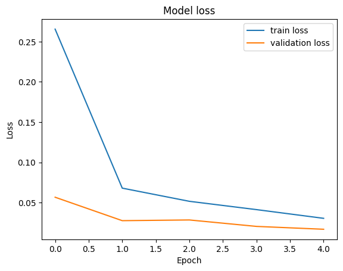

# Vegetable Classification model training and testing
Training and testing CNN, NN, RF, TL, and VGG16 models for Vegetable Image Classification. Project includes data augmentation, and getting the best epoch by detecting overfitting.

# Vegetable Image Dataset
Sample Pictures from datset

# CNN

Overall accuracy: 98.43%

Accuracy vs Loss

Confusion Matrix

# NN

Overall accuracy: 90.97%

Accuracy vs Loss

Confusion Matrix

# Transfer Learning

Overall accuracy: 99.50%

Accuracy vs Loss

# VGG16

Overall accuracy: 99.80%

Accuracy vs Loss

