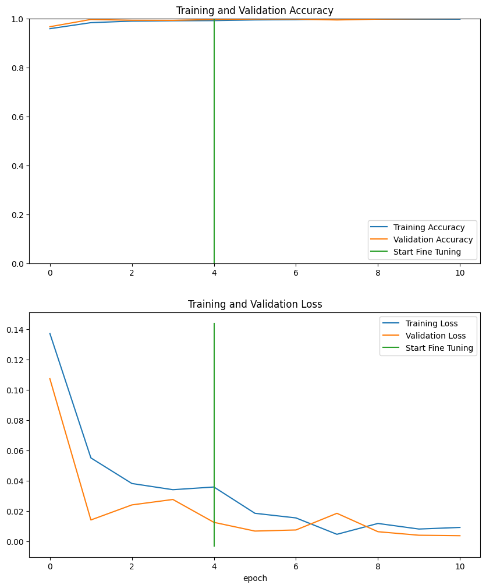

# Vegetable Classification model training and testing
Training and testing CNN, NN, RF, TL, and VGG16 models for Vegetable Image Classification. Project includes data augmentation, and getting the best epoch by detecting overfitting.

# Vegetable Image Dataset
Sample Pictures from datset

# CNN
Accuracy vs Loss

Confusion Matrix

# NN
Accuracy vs Loss

Confusion Matrix

# Transfer Learning
Accuracy vs Loss

# VGG16
Accuracy vs Loss

